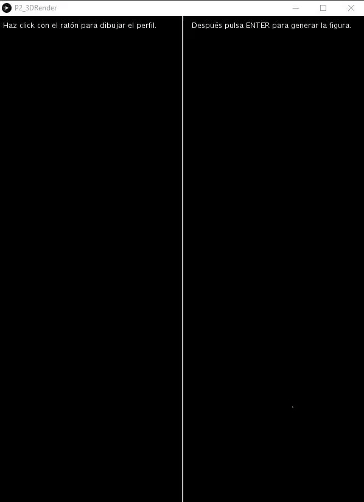

# 3D Render. Solid of revolution

### Autor: Jonay Suárez Ramírez

## Descripción

La aplicación creada permite definir el perfil de una figura clickando con el ratón y después renderizar el sólido de revolución resultante de rotar ese perfil alrededor del eje Y.

Para mostrar bien la figura decidí trasladar el origen del eje X al centro de la ventana, la línea vertical blanca en el centro de la ventana al iniciar es el eje Y.

Se muestran textos con los controles en la parte superior de la pantalla para que su uso sea simple y no necesite documentación extra para entender como funciona la aplicación.

En el resto de aspectos visuales es bastante similar al ejemplo propuesto en el guión de prácticas a excepción del color usado para la malla triangular de la figura 3D.

## Controles

- Click con el ratón y se va dibujando el perfil generado al unir los puntos por rectas.
- Cuando el perfil esté completado ENTER para generar y renderizar el sólido de revolución.
- R en cualquier momento resetea al estado inicial para empezar a dibujar el perfil.

## Referencias y Herramientas

Gif hecho con Gyazo.

Guión de prácticas de CIU.

## Resultado

